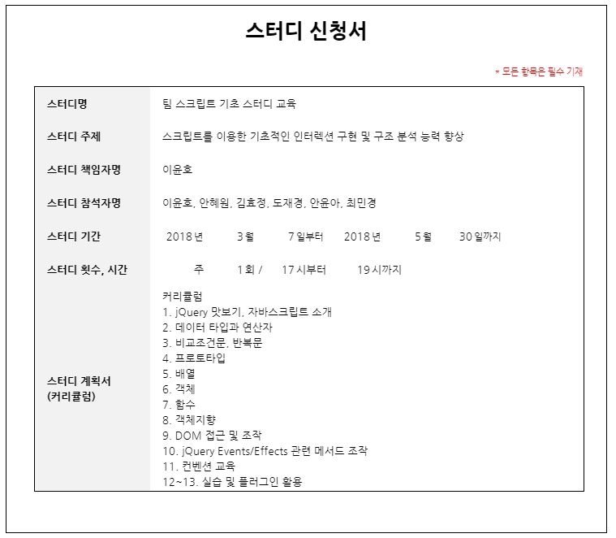

JS study 
=============

## [list(index)](https://yungvely.github.io/study/)

> 2018.3.7 1회차
>> - **Code**
>>>-[STUDY시간 LOG](https://yungvely.github.io/study/ex01_180307/test_onClass.html)
>> - **Homework**
>>>-[SELECTOR](https://yungvely.github.io/study/ex01_180307/exam/selector.html)  
>>>-[SELECTOR2](https://yungvely.github.io/study/ex01_180307/exam/selector2.html)
>> - **Feedback**
>>>-[FEEDBACK](https://yungvely.github.io/study/ex01_180307/exam/feedback1.html)  
>>>-[FEEDBACK2](https://yungvely.github.io/study/ex01_180307/exam/feedback2.html)

> 2018.3.14 2회차
>> - **Code**
>>>-[STUDY시간 LOG](https://yungvely.github.io/study/ex02_180314/test_onClass.html) 
>>>-[수업 보충 설명](https://goo.gl/t1iap6)
>> - **Homework**
>>>-[Array,String,Object.prototype 정리](https://goo.gl/EgDuL2)  
>>>-[IF](https://yungvely.github.io/study/ex02_180314/exam/if.html)  
>>>-[FOR](https://yungvely.github.io/study/ex02_180314/exam/for.html)
>> - **Feedback**

